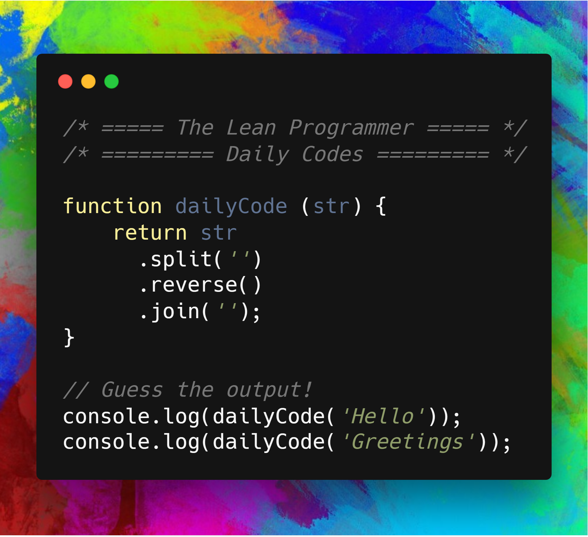

# [Fizz Buzz Problem](https://medium.com/code-to-express/daily-codes-day-1-the-classical-fizzbuzz-problem-346abe09101c)

Write a program that prints the numbers from 1 to 100 and for multiples of ‘3’ print “Fizz” instead of the number and for the multiples of ‘5’ print “Buzz”.

Read Full Problem Here: [Fizz Buzz](https://medium.com/code-to-express/daily-codes-day-1-the-classical-fizzbuzz-problem-346abe09101c)


## [JavaScript implementation](./strRev.js)

```js
function fizzbuzz (num) {
    console.log('Solving FizzBuzz Problem');         

    for(var i=1; i<=num; i++) {
        if (i%3 === 0 && i%5 === 0) {
            console.log("FizzBuzz");
        } else if (i%3 === 0) {
            console.log("Fizz");
        } else if (i%5 === 0) {
            console.log("Buzz");
        } else {
            console.log(i);
        }
    }
}

// Guess the output
console.log('FizzBuzz upto 5');
fizzbuzz(5);
```

