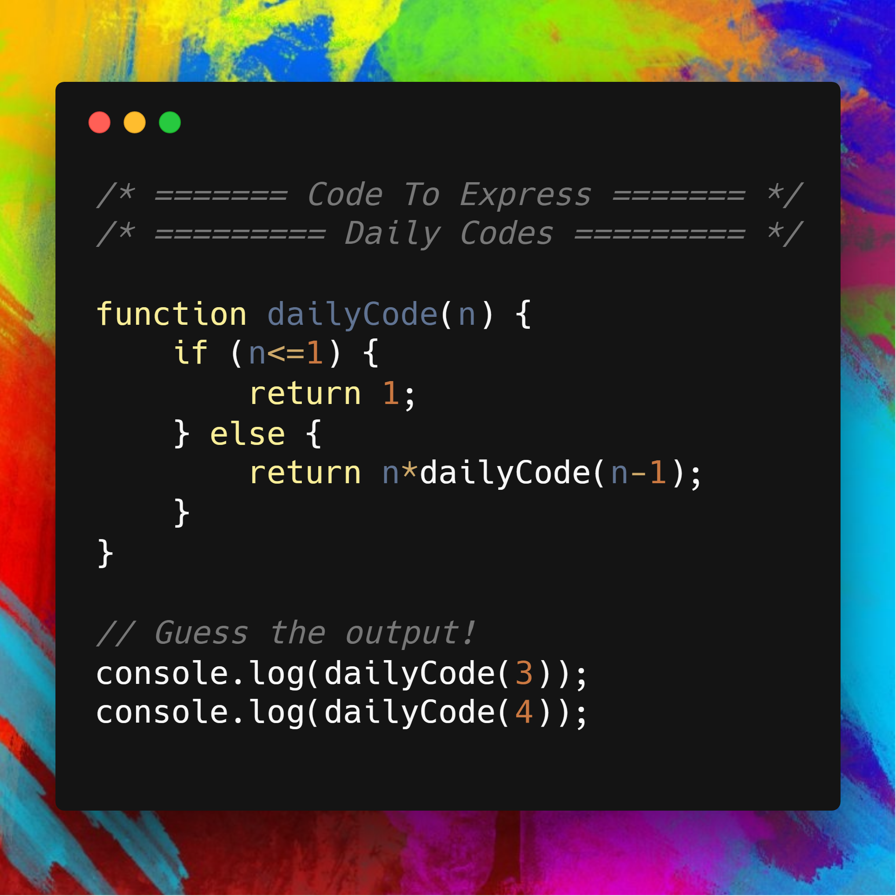

# Factorial Using Recursion


## [Javascript Implementation](./fact.js)

```js
function dailyCode(n) {
    if (n<=1) {
        return 1;
    } else {
        return n*dailyCode(n-1);
    }
}

// Guess the output!
console.log(dailyCode(3)); 
console.log(dailyCode(4)); 
```



## [Python Implementation](./fact.py)

```python
def fact(n):
    s=1
    for i in range(1,n+1):
        s=s*i
    return s

# Guess the output!
print(fact(3))
print(fact(4))
```

## [C Implementation](./fact.c)

```c
// fact Function
int fact(int num) {
    if(num == 0)
        return 1;
    else
        return num * fact(num - 1);
}

//main Function
int main(void) {
    int answer;
    answer = fact(5);
    printf("Factorial is: %d", answer);
    return 0;
}
```

## [C++ Implementation](./fact.cpp)

```cpp
#include<iostream>

using namespace std;

// Factorial Function
int factorial(int n)
{
    int s=1;
    for(int i=1;i<=n;i++)
    {
        s*=i;
    }
    return s;
}

// main function
int main()
{
    int n=5;
    int answer=factorial(n);
    cout<<"Factorial is: "<<answer<<endl;
    return 0;
}
```

## [Java Implementation](./fact.java)

```java
class factorial{

	public static int factorial(int num){
		if( num == 1){
			return 1;
		}
		else{
			return num * factorial(num-1);
		}
	}

	public static void main(String args[]){

		System.out.println("Factorial of 5 = " + factorial(5));

	}
}
```
